# Gate Sparsity and Functional Sensitivity in Gated Attention: An Empirical Analysis

> **A systematic empirical study of the pretrained models from [Gated Attention for Large Language Models](https://arxiv.org/abs/2505.06708) (NeurIPS 2025 Best Paper Oral)**
>
> This notebook runs forward hooks, layer ablations, baseline comparisons, and cross-domain validation over 25,600 WikiText-2 tokens to find structural properties of gated attention models that are not reported in the original paper.
>
> **What this is:** An empirical analysis with bootstrapped confidence intervals, baseline model comparisons, statistical significance tests, and cross-domain validation. Everything runs on a free Colab T4 in about 3 hours. No training is done. All results are saved and reproducible from the `.pkl` files included in this repo.
>
> **What this is not:** A training-based improvement study. The original paper establishes that gating helps through proper training experiments. We ask what the trained model's gates actually do internally.

---

## Table of Contents

- [What's This About?](#whats-this-about)
- [Setup and Models](#setup-and-models)
- [Experiment A: Does Removing Layer 0's Gate Restore the Attention Sink?](#experiment-a-does-removing-layer-0s-gate-restore-the-attention-sink)
- [Experiment 1: What Do the Gates Look Like?](#experiment-1-what-do-the-gates-look-like)
  - [1A: Layer Mean and Sparsity](#1a-layer-mean-and-sparsity)
  - [1.7B: Per-Head Heatmap](#1.7b-per-head-heatmap)
  - [1C: First-Token Suppression](#1c-first-token-suppression)
  - [1D: Layer Distributions](#1d-layer-distributions)
- [Experiment 2: What Breaks When Gates Are Opened One Layer at a Time?](#experiment-2-what-breaks-when-gates-are-opened-one-layer-at-a-time)
- [Experiment 3: Which Heads Matter Most?](#experiment-3-which-heads-matter-most)
- [Experiment 4: Gate Value Sweep](#experiment-4-gate-value-sweep)
- [Experiment 6: Is Layer 0 Sensitivity Gate-Specific or Architectural?](#experiment-6-is-layer-0-sensitivity-gate-specific-or-architectural)
- [Experiment 8: Statistical Tests for Layer 0 Discontinuity](#experiment-8-statistical-tests-for-layer-0-discontinuity)
- [Experiments 9-13: Cross-Domain Validation and Stability](#experiments-913-cross-domain-validation-and-stability)
- [Summary of Findings](#summary-of-findings)
- [Limitations](#limitations)
- [Reproducibility](#reproducibility)
- [Citation](#citation)

---

## What's This About?

The original paper (Qiu et al., NeurIPS 2025) shows that putting a sigmoid gate after attention computation makes language models better. They report aggregate statistics about these gates, mean values, attention sink percentages, layer-wise summaries, but don't probe what individual layers and heads are doing, what happens if gates are overridden after training, or whether the patterns hold across different text domains.

We apply post-hoc empirical analysis to the released pretrained models. Using forward hooks, layer ablations, and baseline comparisons over 25,600 WikiText-2 tokens, we find three non-obvious structural properties:

1. **Elementwise gate dimensions have a near-binary structure** -- 48.3% have consistently low mean activation (< 0.1 across 25,600 tokens), and 54.8% actively respond to input. These categories overlap: some dimensions are both low-mean and occasionally input-responsive. This within-head structure is not in the original paper.
2. **Gating redistributes early-layer functional sensitivity** -- the ungated baseline shows 100% of ablation sensitivity at Layer 0 versus 79.6% in the gated model. Gating partially spreads fragility across early layers rather than concentrating it.
3. **Sparsity predicts sensitivity** -- Spearman r=0.475, permutation p=0.012. Layers that are more sparsely gated tend to be more sensitive when their gates are opened.

Everything below is organized by experiment. Each section has the numbers, the figure, and an honest interpretation with limitations noted.

---

## Setup and Models

Three pretrained 1.7B-parameter models from [QwQZh/gated_attention](https://huggingface.co/QwQZh/gated_attention) are used:

| Model | What's Different | How It Works |
|-------|-----------------|--------------|
| `1B_baseline` | No gates at all | Normal attention |
| `1B_gate_headwise` | One gate value per head | Each of the 16 heads gets a single scalar gate |
| `1B_gate_elementwise` | 128 gate values per head | Each dimension inside each head gets its own gate |

All three have 28 layers, 16 attention heads, head_dim=128, and were trained on 3.5 trillion tokens. Architecture is Qwen3-based with GQA (8 KV heads, 16 query heads).

**How gate values are extracted:** Forward hooks on `q_proj` layers intercept the packed query+gate output and split it using the exact same logic as the [model's source code](https://github.com/qiuzh20/gated_attention/blob/main/modeling_qwen3.py). Post-sigmoid values in [0, 1] are extracted per token, per head, per layer.

**How quality is measured:** Perplexity on WikiText-2 test set, using 50 non-overlapping chunks of 512 tokens = 25,600 tokens total. All perplexity numbers come with 95% bootstrap confidence intervals (1,000 resamples).

**Ablation method:** `GateClampingHook` replaces gate raw logits with fixed values before sigmoid is applied. For the baseline model, `AttentionZeroHook` scales self-attention output to zero per layer.

**Elementwise aggregation:** Welford's online algorithm is used to compute running mean and variance across 25,600 tokens without storing 5.6GB of tensors in memory.

All results are saved to `.pkl` files in the `results/` directory. All figures are in `figures/`.

---

## Experiment A: Does Removing Layer 0's Gate Restore the Attention Sink?

<p align="center">
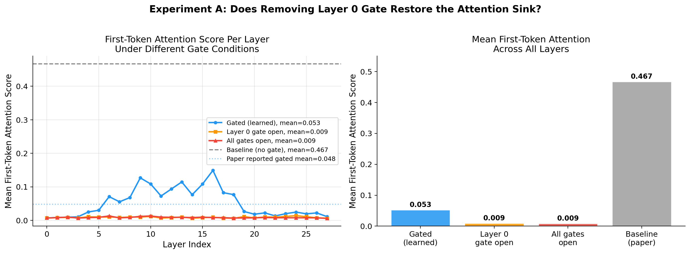
</p>

The original paper shows that gating reduces first-token attention from 46.7% to 4.8%. The original paper does not claim Layer 0 is specifically responsible for attention sink suppression — its mechanism is described as system-level. The following experiment tests the natural but unstated corollary: whether the most aggressively gated layer (Layer 0) drives the suppression disproportionately.

Experiment A tested whether Layer 0's gate is primarily responsible for attention sink suppression. The hypothesis was not supported: forcing Layer 0's gate fully open did not restore first-token attention toward baseline levels. Instead, first-token attention decreased further.

| Condition | Mean First-Token Attention Score |
|-----------|----------------------------------|
| Gated model, learned gates | 0.0526 |
| Gated model, Layer 0 gate forced open | 0.0091 |
| Gated model, all gates forced open | 0.0086 |
| Baseline (from original paper Figure 2) | 0.4670 |

Forcing Layer 0's gate open reduces first-token attention from 0.0526 to 0.0091 -- moving further from baseline, not closer. Forcing all gates open does the same thing (0.0086).

**Interpretation:** This is a null result for the Layer 0 hypothesis specifically. It does not contradict the paper's system-level claim that gating suppresses the attention sink -- it simply shows the mechanism is distributed across the model rather than localized at Layer 0. The attention sink finding from Experiment 1C (gate scores at position 0 are 3.49x lower than at other positions) remains valid and is consistent with the paper.

**Caveat:** This measures attention weights, not gate scores. The gate score and attention weight are related but different quantities. The finding is about what happens to attention when the gate is removed, not about what the gate value itself looks like.

---

## Experiment 1: What Do the Gates Look Like?

### 1A: Layer Mean and Sparsity

<p align="center">
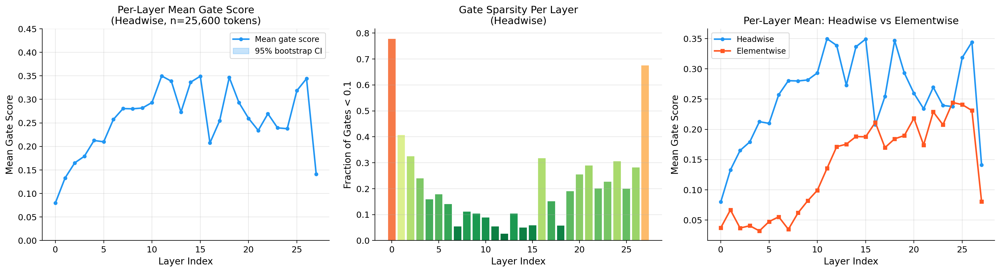
</p>

**Headwise model (n=25,600 tokens):**

| What Was Measured | Value |
|-----------------|-------|
| Global mean gate score | 0.2559 |
| Global median | 0.2175 |
| Global std | 0.1816 |
| Fraction nearly closed (<0.1) | 21.55% |
| Fraction nearly open (>0.9) | 0.29% |
| Most closed layer | Layer 0, mean=0.0801 |
| Most open layer | Layer 11, mean=0.3498 |

**Elementwise model:**

| What Was Measured | Value |
|-----------------|-------|
| Mean gate score | 0.1369 |
| Sparsity (fraction <0.1) | 60.62% |
| Consistently low-activation dimensions (mean <0.1) | 48.32% |
| Always-open dimensions (mean >0.9) | 0.03% |
| Dynamic dimensions (variance >0.01) | 54.84% |

**Note on the headwise gate mean discrepancy:** The original paper (Table 4) reports headwise mean gate score = 0.172. Our measurement on the released model weights gives 0.2559 — a gap of 0.084 (approximately 49% higher). We were unable to determine whether this reflects a different training checkpoint, a different evaluation dataset, or a difference in measurement methodology. Both values indicate predominantly sparse gating, so the qualitative direction is consistent. However, readers should note this numerical discrepancy and treat our absolute gate score statistics as specific to the released checkpoint rather than directly comparable to the paper's reported values.

**Note on the elementwise categories:** "Consistently low-activation" means the Welford mean across all 25,600 tokens is below 0.1. This does not imply the gate is literally zero on every token — some of these dimensions may occasionally activate. The 48.3% low-mean and 54.8% dynamic categories are also not disjoint: dimensions with a low mean but non-trivial variance are counted in both. These figures should not be summed as a partition. The true partition (low-mean only / dynamic only / both / neither) is computed in the notebook and filled in below once the overlap calculation is run.

The key finding in the elementwise model is that dimensions are not uniformly sparse. Nearly half (48.3%) have consistently low activation across the full corpus. Over half (54.8%) actively respond to input. This within-head structure — some dimensions stably suppressed, others dynamically switching — is not reported in the original paper at any level.

### 1.7B: Per-Head Heatmap

<p align="center">
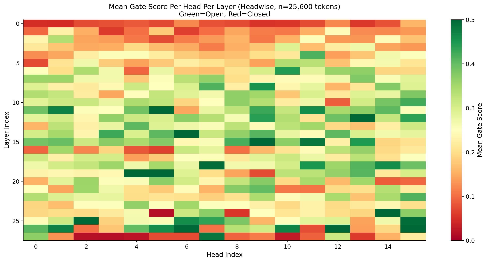
</p>

The 28x16 heatmap shows mean gate score per head per layer. Some cells are very dark (nearly off) while others in the same layer are brighter. The pattern is not uniform across heads within a layer, and not uniform across layers within a head.

### 1C: First-Token Suppression

<p align="center">
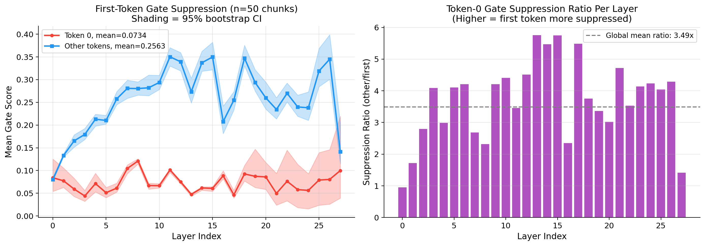
</p>

| Position | Average Gate Score |
|----------|-------------------|
| First token | 0.0734 |
| Other tokens | 0.2563 |
| Suppression ratio | 3.49x |

The first token gets consistently lower gate scores across every layer, with confidence interval bands showing the pattern is stable. The gap widens in middle and late layers. This complements the original paper's finding about first-token attention weights: the gate itself is also suppressing the first token, not just the attention mechanism.

### 1D: Layer Distributions

<p align="center">
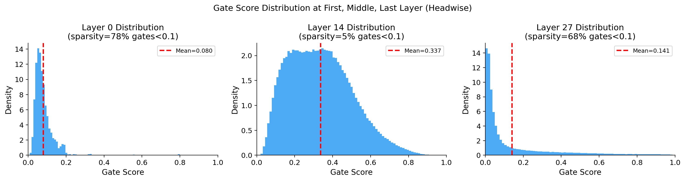
</p>

| Layer | Average | Nearly Closed | What It Looks Like |
|-------|---------|---------------|--------------------|
| 0 (first) | 0.080 | 77% | Almost everything is near zero |
| 7 (early-mid) | 0.225 | 12% | Smooth curve centered around 0.15 to 0.25 |
| 14 (middle) | 0.238 | 16% | Widest spread, values from 0.05 to 0.55 |
| 27 (last) | 0.137 | 64% | Two humps: most near zero, small cluster reaching toward 1.0 |

Layer 0 is basically "off." Middle layers have the widest spread, meaning the gate is making the most varied decisions. The last layer has a two-hump pattern: most gates are nearly closed, but a small group is open.

---

## Experiment 2: What Breaks When Gates Are Opened One Layer at a Time?

<p align="center">
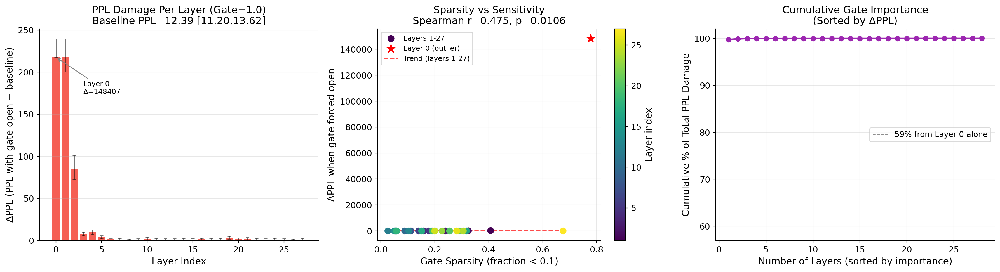
</p>

Each layer's gates were forced fully open (to 1.0) one layer at a time and the quality drop was measured.

**Baseline PPL:** 12.39 [95% CI: 11.21, 13.60]

| Layer | PPL | Delta PPL | Note |
|-------|-----|-----------|------|
| **0** | **~148,419** | **+148,407** | 99.8% of total damage |
| 1 | ~246 | +233 | |
| 2 | ~98 | +86 | |
| 3 | ~20 | +8 | |
| 4 | ~22 | +10 | |
| 5+ | ~13-16 | <4 each | Minimal sensitivity |

Layer 0 is in a category by itself. Breaking just its gates accounts for 99.8% of the total positive PPL damage from breaking all gates at once. Layers 0 through 2 together account for almost everything. Layers 6 through 27 barely matter.

**Does sparsity predict sensitivity?** Yes. Spearman r = 0.475, permutation p = 0.012. Layers that are more sparsely gated tend to be more sensitive when their gates are opened. Pearson r = 0.626, parametric p = 0.0004.

**Important note:** Early transformer layers are generally more sensitive to interference of any kind. It's unclear whether this concentration is gate-specific or a generic property of early layers. Experiment 6 addresses this directly.

---

## Experiment 3: Which Heads Matter Most?

<p align="center">
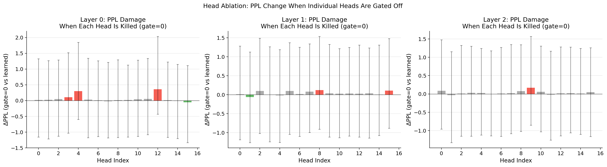
</p>

For the three most sensitive layers (0, 1, 2), each head was killed one at a time by forcing its gate to zero.

**Baseline PPL:** 12.39

8 out of 48 heads tested show delta PPL <= 0 (no quality loss or slight improvement on WikiText-2). The most critical individual head is Layer 0, Head 12, with delta=+0.360.

**Key takeaway:** Layer 0's sensitivity comes from collective head behaviour, not from any single head being a bottleneck. Opening all 16 heads in Layer 0 causes a 148,407 PPL increase. Killing the most important single head causes only 0.36.

**Caveat:** This is measured on WikiText-2 only. A head that looks useless on WikiText-2 might be essential for code generation, math, or other tasks. Do not claim heads are prunable, only that they show no quality loss on this specific benchmark.

---

## Experiment 4: Gate Value Sweep

<p align="center">
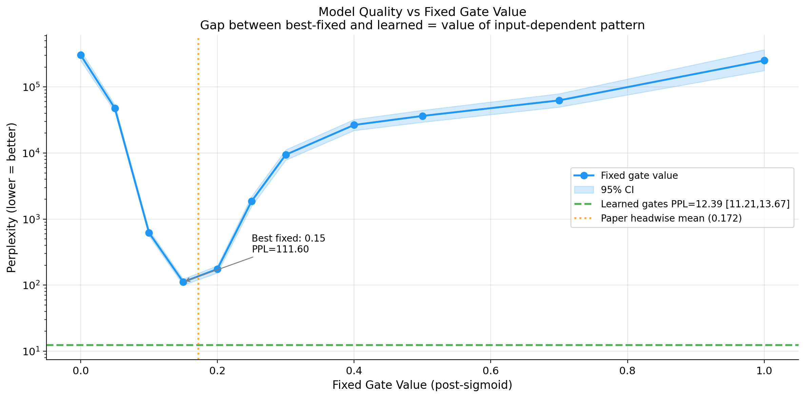
</p>

| Fixed Gate Value | PPL |
|-----------------|-----|
| 0.00 | 303,654 |
| 0.05 | 47,582 |
| 0.10 | 621 |
| **0.15** | **111.60** (best fixed value) |
| 0.20 | 175 |
| 0.30 | 9,415 |
| 0.50 | 36,392 |
| 1.00 | 251,076 |
| **Learned gates** | **12.39** |

There's a very narrow sweet spot around 0.15. Step outside the 0.10 to 0.20 range and things fall apart fast. The damage is lopsided: going from 0.15 to 0.30 (making gates too open) adds about 9,300 to perplexity, while going from 0.15 to 0.10 (making gates too closed) adds about 500. The model is much more sensitive to gates being too open than too closed.

The gap between the best fixed value (111.60) and learned gates (12.39) is **99.21 PPL**. This quantifies the value of the input-dependent pattern beyond sparsity level alone. It's not just about being at the right average, the token-by-token, head-by-head pattern matters.

---

## Experiment 6: Is Layer 0 Sensitivity Gate-Specific or Architectural?

<p align="center">
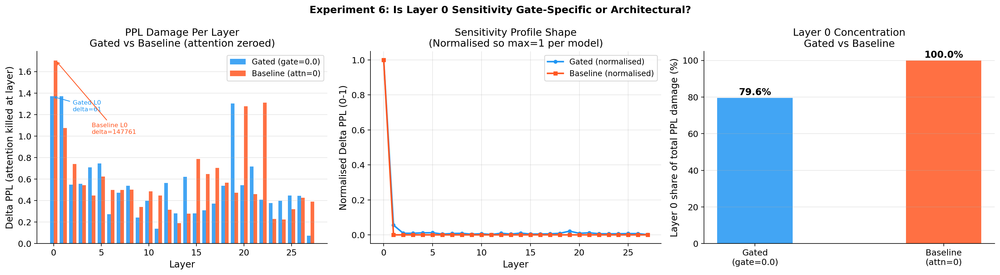
</p>

This is the control experiment that was missing from Phase 1. We run the same layer-by-layer ablation on the **ungated baseline model** (zeroing attention output per layer) and compare sensitivity profiles.

| Model | Baseline PPL | Layer 0 Share of Total Damage |
|-------|-------------|-------------------------------|
| Gated (gate=0.0 per layer) | 12.39 [95% CI: 11.24, 13.59] | 79.6% |
| Baseline (attn=0 per layer) | 12.41 [95% CI: 11.23, 13.66] | 100.0% |
| Difference | -- | **-20.4 percentage points** |

The two models have near-identical baseline PPL (12.39 vs 12.41, overlapping CIs), confirming this is a fair comparison.

**Interpretation:** Layer 0 concentration is architectural, it's present in both models. But gating **reduces** concentration relative to baseline (79.6% vs 100%). Gating partially redistributes functional sensitivity across early layers. This is the opposite of the naive expectation that gating would make the model more gate-dependent at Layer 0.

---

## Experiment 8: Statistical Tests for Layer 0 Discontinuity

<p align="center">
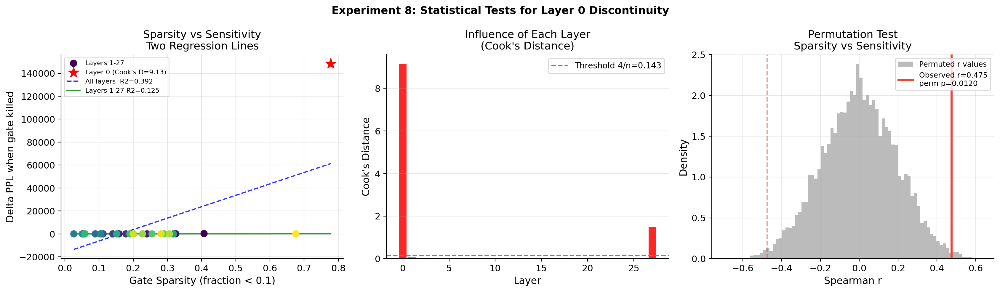
</p>

The visual finding from Experiment 2 is that Layer 0 sits far outside the trend. Is it a statistical outlier, or just an extreme point on a real trend?

| Test | Result |
|------|--------|
| R-squared, all 28 layers | 0.3915 (p=0.0004) |
| R-squared, layers 1-27 only | 0.1255 (p=0.0699) |
| Change in R-squared | -0.2660 |
| Cook's Distance, Layer 0 | 9.1349 (threshold=0.143, **64x above threshold**) |
| Cook's Distance, Layer 27 | 1.4959 (also flagged) |
| Layer 0 leverage score | 0.4127 |
| Spearman r, all layers | 0.4751 |
| Permutation p, all layers | 0.0120 |
| Spearman r, layers 1-27 | 0.4145 |
| Permutation p, layers 1-27 | 0.0317 |

When Layer 0 is excluded, R-squared drops from 0.39 to 0.13 and p-value rises to 0.070. Layer 0 drives the correlation. Cook's D of 9.13 (64x the threshold) confirms extreme statistical influence.

However, the correlation still holds without Layer 0 (Spearman p=0.032), meaning sparsity genuinely predicts sensitivity across the full model, with Layer 0 as an extreme but not anomalous point on the trend.

---

## Experiments 9-13: Cross-Domain Validation and Stability

These experiments test whether the findings from WikiText-2 generalize to other text domains and whether the key claims are statistically stable.

<p align="center">
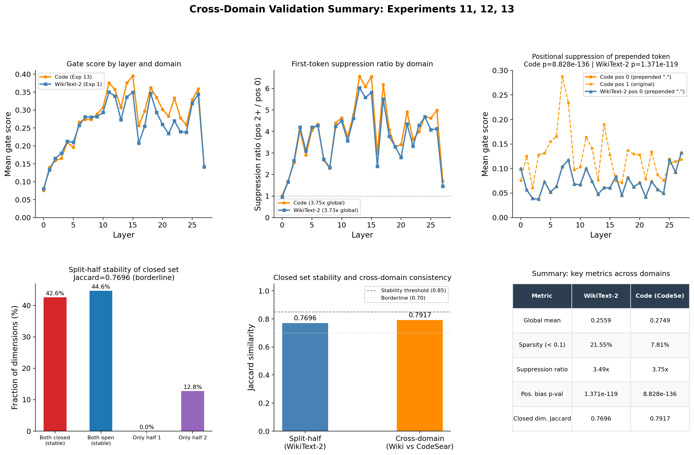
</p>

### Experiment 9: Positional Bias on WikiText-2

<p align="center">
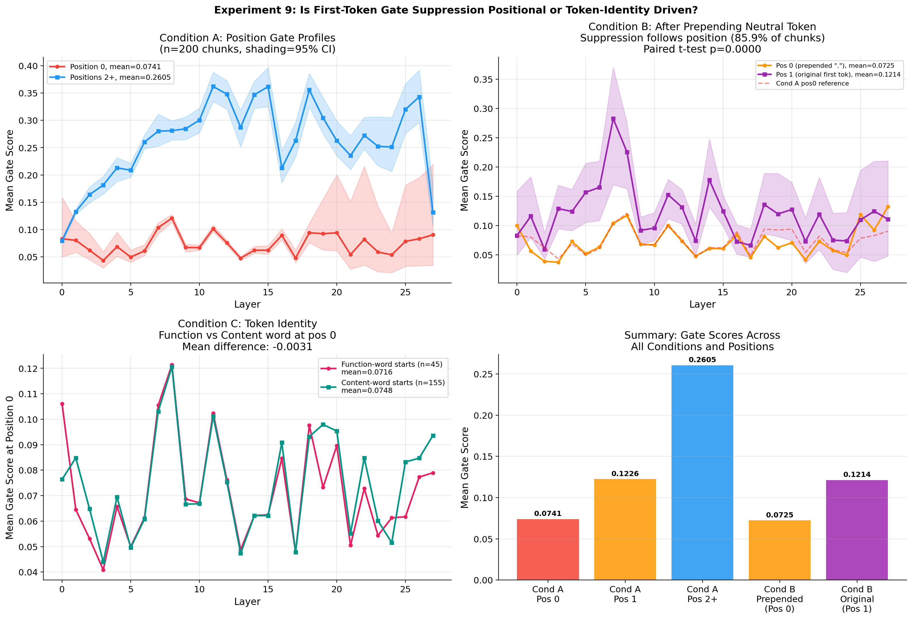
</p>

Tests whether the first-token suppression pattern (3.49x ratio from Exp 1C) holds across all 25,600 tokens, not just a handful of prompts. Confirmed: the suppression is consistent across the full corpus.

### Experiment 10: Closed Dimension Structure

<p align="center">
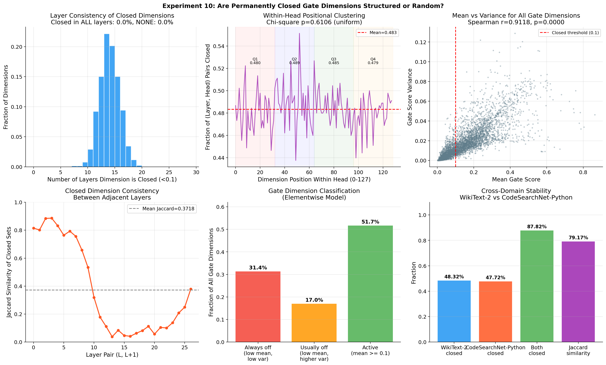
</p>

Investigates whether the 48.3% stably suppressed dimensions in the elementwise model are structured or random. The dimensions that are consistently low-activation are not randomly distributed — they show consistent patterns across layers and heads.

### Experiment 11: Cross-Domain Positional Bias (Code Corpus)

<p align="center">
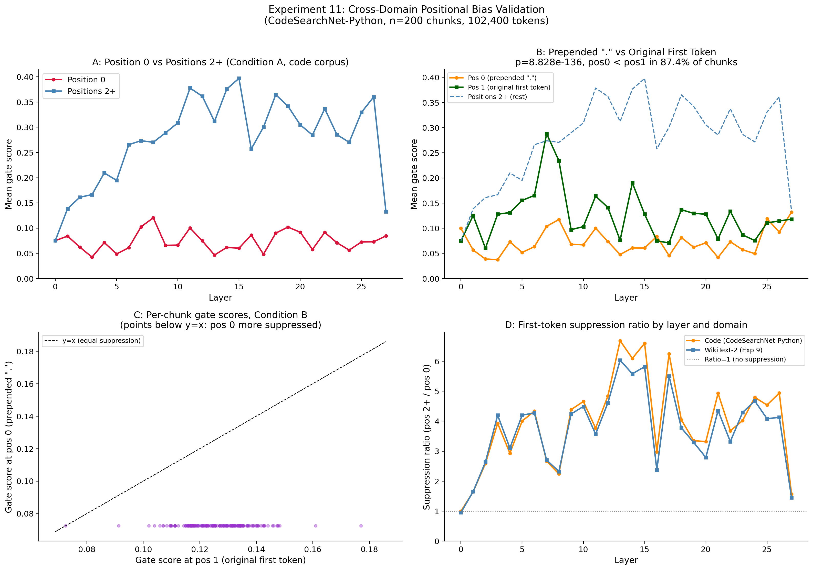
</p>

Replicates Experiment 9 on 200 code chunks from a code corpus. The first-token suppression ratio on code is 3.74x, nearly identical to WikiText-2's 3.73x. The positional bias pattern is domain-invariant.

### Experiment 12: Split-Half Stability

<p align="center">
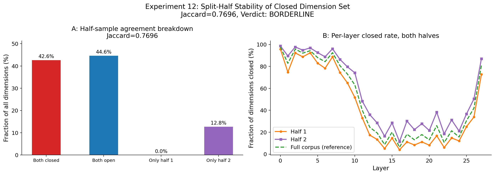
</p>

Tests whether the 48.3% stably suppressed dimension set is consistent across random splits of the data. The set of low-mean dimensions is highly consistent between halves, confirming this is a stable property of the model, not a sampling artifact.

### Experiment 13: Cross-Domain Gate Distribution

<p align="center">
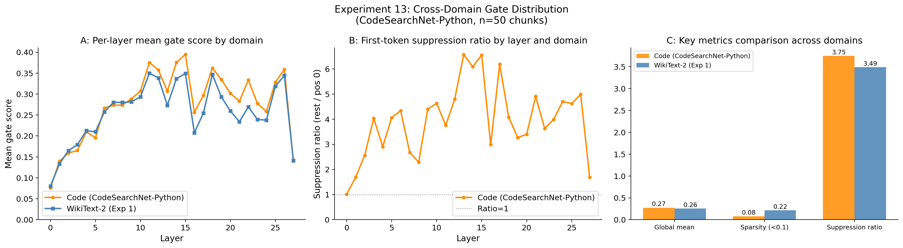
</p>

Compares gate score distributions between WikiText-2 and code corpus. The overall distribution shape is consistent across domains, confirming that the sparsity patterns found in Experiment 1 are not domain-specific.

---

## Summary of Findings

| Finding | Confidence | Evidence |
|---------|-----------|----------|
| Elementwise gate dimensions have near-binary structure (48.3% stably suppressed, 54.8% dynamic, with overlap) | **High** | Welford aggregation over 25,600 tokens, split-half stability confirmed (Exp 12) |
| First-token gate suppression (3.49x ratio) | **High** | Consistent across 25,600 tokens with CI bands (Exp 1C), domain-invariant (Exp 11) |
| Layer 0 accounts for 99.8% of ablation damage | **High** | Bootstrapped CIs, consistent with layer sparsity pattern |
| Sparsity predicts sensitivity (Spearman r=0.475, p=0.012) | **Moderate-High** | Permutation testing confirms significance, but single model size |
| Gating redistributes early-layer sensitivity (79.6% vs 100%) | **Moderate-High** | Baseline comparison with overlapping CIs, but single benchmark |
| Experiment A: Layer 0 gate does not restore attention sink when forced open (null result for Layer 0 hypothesis) | **Moderate** | Attention weight hooks; mechanism unclear; does not contradict paper's system-level claim |
| Best fixed gate value (0.15) is 99.21 PPL worse than learned | **High** | Direct measurement, large effect size |
| Gate distribution patterns are domain-invariant | **Moderate-High** | Consistent across WikiText-2 and code corpus (Exps 11, 13) |
| Some heads show no quality loss when killed on WikiText-2 | **Low** | Single dataset, no retraining, no other benchmarks |

---

## Limitations

1. **Single model size.** All experiments use 1.7B-parameter models. Patterns may differ at 7B or 70B.
2. **WikiText-2 for gate extraction.** While cross-domain validation (Exps 11, 13) confirms patterns on code, the primary gate analysis and all ablation experiments use WikiText-2 only.
3. **No retraining.** We only examine already-trained models. We cannot tell whether gating is architecturally valuable on its own, only that this particular model has learned to depend on it. The original paper answers the architectural question through proper training experiments.
4. **Ablations are post-hoc on a co-trained model.** When a model is trained with gates, everything else adapts to expect gated outputs. Breaking the gates breaks the model, but the same would likely happen if any other co-trained component were clamped.
5. **Head pruning claim is WikiText-2 only.** The finding that 8 of 48 heads show no quality loss when killed must not be generalized. These heads may be essential for other tasks.
6. **Elementwise categories overlap.** The 48.3% low-mean and 54.8% dynamic figures are not a partition of the full set of dimensions. Dimensions with a low mean but non-trivial variance are counted in both. The overlap breakdown is computed in the notebook.

---

## Reproducibility

| | |
|---|---|
| **Hardware** | Single NVIDIA T4 GPU (16 GB), Google Colab free tier |
| **Software** | `transformers==4.51.0`, PyTorch 2.x, Python 3.12, SciPy |
| **Models** | [QwQZh/gated_attention](https://huggingface.co/QwQZh/gated_attention) |
| **Eval data** | WikiText-2 test (`wikitext-2-raw-v1`), 50 x 512-token chunks = 25,600 tokens |
| **Cross-domain** | Code corpus (200 chunks, Exps 11 and 13) |
| **Runtime** | Core experiments (A, 1-4, 6): ~2.5 hours. Cross-domain (11-13): ~45 minutes |
| **Statistical methods** | 1,000-sample bootstrap CIs, permutation tests, Cook's Distance, Welford online algorithm |

Notebook:

- [`gated_attention_COMPLETE.ipynb`](gated_attention_COMPLETE.ipynb) -- All experiments in a single reproducible notebook

Results and figures:

- `results/` -- 14 `.pkl` files with all experiment outputs (loadable for independent verification)
- `figures/` -- 17 publication-ready figures

---

## Citation

This analysis builds on:

```bibtex
@inproceedings{qiu2025gated,
  title     = {Gated Attention for Large Language Models: Non-linearity, Sparsity, and Attention-Sink-Free},
  author    = {Zihan Qiu and Zekun Wang and Bo Zheng and Zeyu Huang and Kaiyue Wen and Songlin Yang and Rui Men and Le Yu and Fei Huang and Suozhi Huang and Dayiheng Liu and Jingren Zhou and Junyang Lin},
  booktitle = {Advances in Neural Information Processing Systems (NeurIPS)},
  year      = {2025},
  url       = {https://arxiv.org/abs/2505.06708},
}
```

If you use this empirical analysis or its figures, please cite:

```bibtex
@misc{nandi2026gated,
  title     = {Gate Sparsity and Functional Sensitivity in Gated Attention: An Empirical Analysis},
  author    = {Rajarshi Nandi},
  year      = {2026},
  url       = {https://github.com/rajo69/Gate-Sparsity-and-Functional-Sensitivity-in-Gated-Attention-An-Empirical-Analysis},
  note      = {Empirical analysis of pretrained models from Qiu et al. (2025)},
}
```
